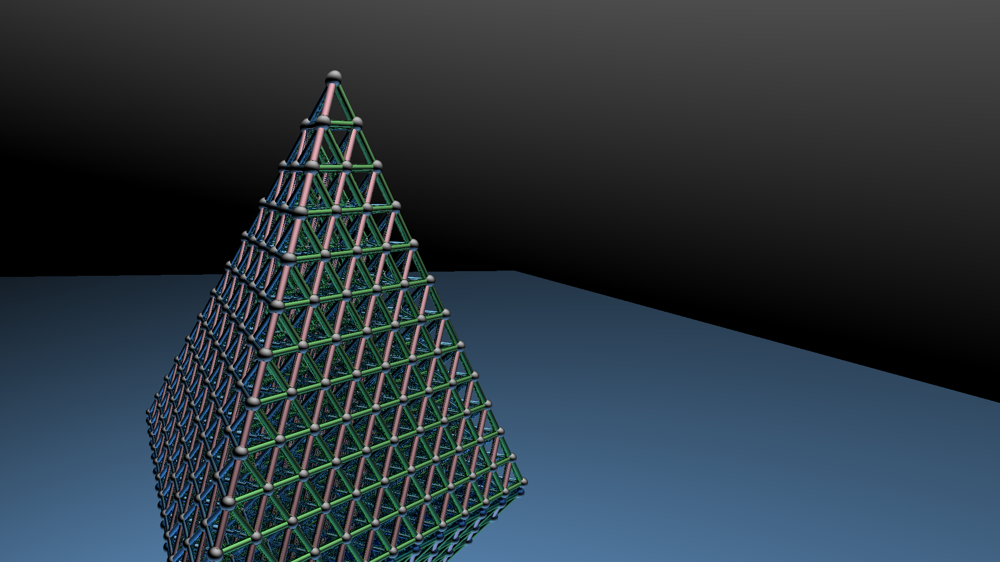

# Ray-Tracing

Ray-tracing, without using any third-party libraries.

An image of this large (1920x1080) requires about 20 seconds and 20M memories. (4 threads, Intel(R) Core(TM) i7-8550U CPU @ 1.80GHz, Windows 10 home)

Core sources are in [Object.h](Object.h), other source files are debugging and quite messy.  
Support intersections of vector planes, triangles, parallelograms, spheres, circles, and cylinders.  
Temporary don't support diffuse reflection and refraction. 

Comparison of non-rendered and rendered images: 

Some result images:  

The rings goes through the most wonderful optimization I have ever made.  
<pre>CPU:     44min => 5.4s
Memory:  1.26GB => 56MB</pre>

The third and fourth image are vector. Each requires less than 2 seconds and less than 2M memories; 

The last two are complex <a href="https://en.wikipedia.org/wiki/Gamma_function" target="_blank">Γ function</a>. Some details are not very well, because my computer don't have that much memories for more triangles.   :-(

Theoretically CPU usage is O(log²(n)) (worst: O(n)) and memory is O(n) 

More images are in "Image/comment.zip". 
