# Ray-Tracing

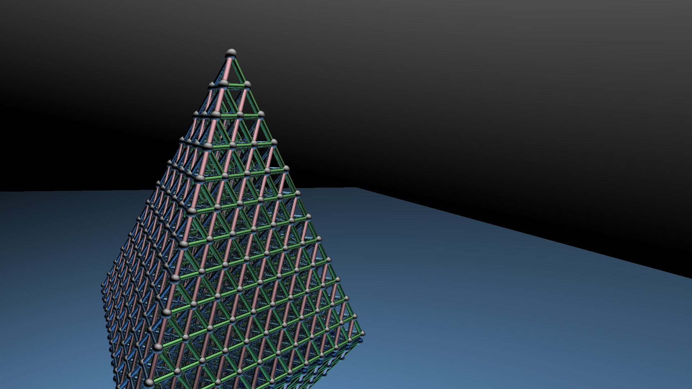

**Ray-tracing, without using any third-party libraries.

An image of this large (1920x1080) requires about 20 seconds and 20M memories. _(4 threads, Intel(R) Core(TM) i7-8550U CPU @ 1.80GHz, Windows 10 home)

All vector objects and intersection algorithms are in [Object.h](Object.h).

Rendering core sources are in [World.h](World.h).

View [Test.cpp](Test.cpp) for sources of given images.

Some sources are still debugging. (2019.5.5)

Support intersections of vector planes, triangles, parallelograms, spheres, circles, and cylinders; refraction of planes and spheres;

Comparison of non-rendered and rendered images:

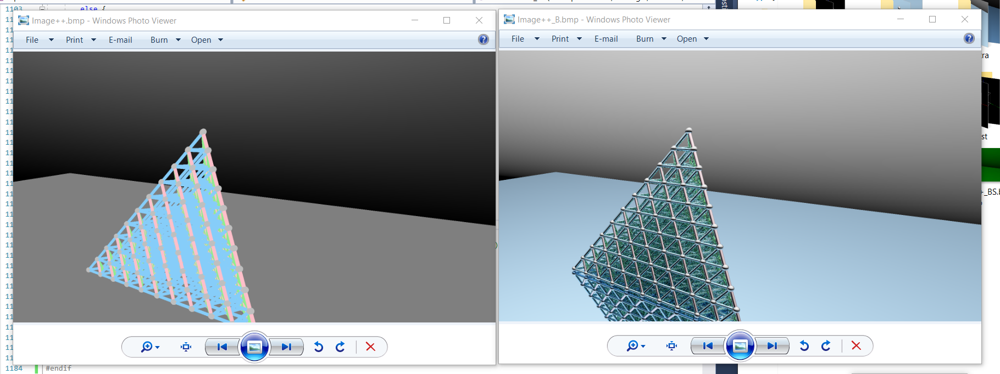

# Triangles

Creating shapes with millions of triangles, although it may be low efficiency. 

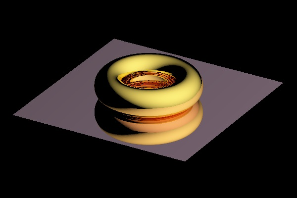
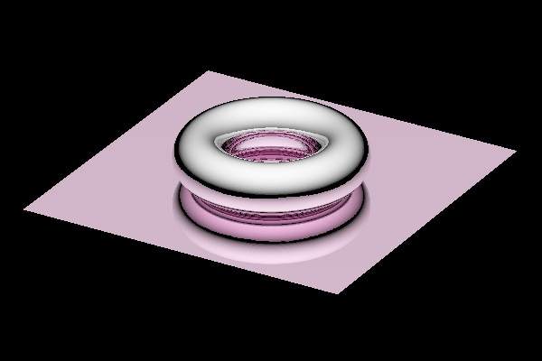

The rings goes through the most wonderful optimization I have ever made.  
<pre>CPU:     44min => 5.4s
Memory:  1.26GB => 56MB</pre>

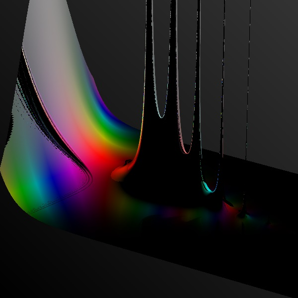

This picture shows <a href="https://en.wikipedia.org/wiki/Gamma_function" target="_blank">Γ function</a> on complex plane. It consists of 1,600,000 triangles. It requires about 20 seconds and about 200M memories to render. 

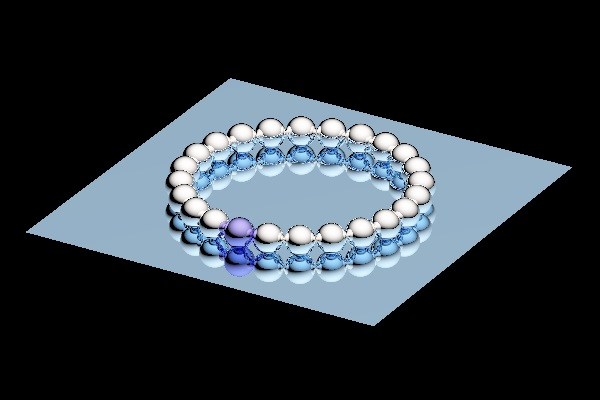
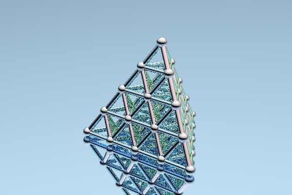

This two pictures are vector spheres and cylindars, each requires less than 1 seconds and less than 1M memories. 

# Refraction

Trace refraction with [Fresnel Equations](https://en.wikipedia.org/wiki/Fresnel_equations) and [Beer-Lambert Law](https://en.wikipedia.org/wiki/Beer%E2%80%93Lambert_law). 

Reference: [https://graphics.stanford.edu/courses/cs148-10-summer/docs/2006--degreve--reflection_refraction.pdf](https://graphics.stanford.edu/courses/cs148-10-summer/docs/2006--degreve--reflection_refraction.pdf)

__Applying Fresnel Equations and Beer-Lambert Law__: 

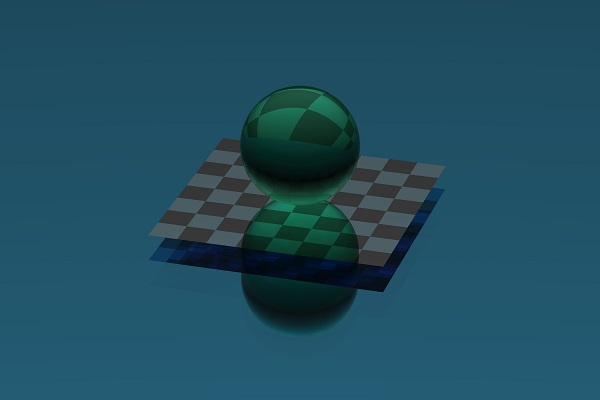

__Different refractive index__: 

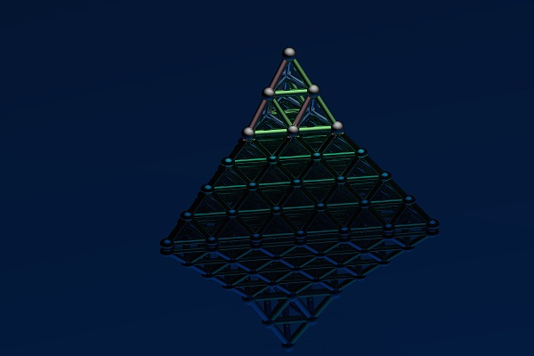  n=1.2

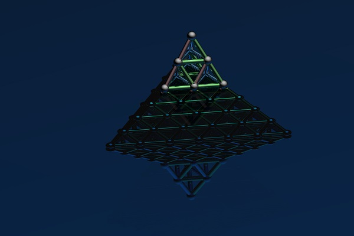  n=1.5

__Insert a bitmap to create a scene__: 

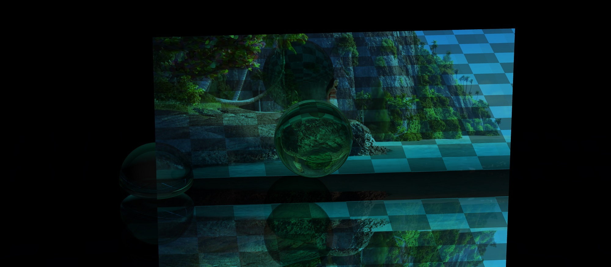  
(Image source: capture of 3D animation film _Moana_, 16:20)

In this picture, the bitmap stands on the water, and a specular-reflecting plane is placed beneath the water. Global light source is behind the camera. 
Fresnel calculation between different medias is still debugging. 

